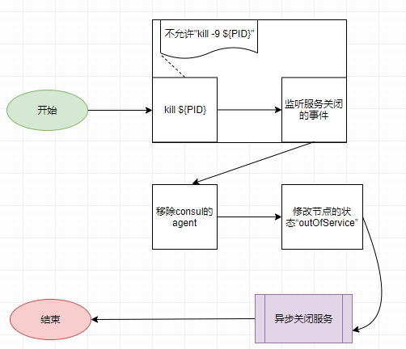

# 1 starter使用简介

**假设，您的微服务使用spring cloud + consul。**

## 1.1 优点

- undertow的性能比tomcat要好很多，直接替换掉，不会造成额外的风险
- 虽然代码很少，但是，已经实现了“平稳发布服务”的目的

## 1.2 使用步骤

- 请检查相关的依赖，避免jar冲突
- 这套代码并没有上传到maven repository，需要在本地打包，然后，`publishToMavenLocal`


做好前面两步后，只需要修改本地的依赖，服务就自动有了graceful shutdown的能力。不需要再添加别的配置。

```
compile("org.undertowx:undertow-starter-graceful-shutdown:1.0-SNAPSHOT")
```

# 2 源码简介



| 命令             | 描述                                            | 状态 |
| ---------------- | ----------------------------------------------- | ---- |
| kill ${PID}      | 通知运维，禁止使用命令"kill -9 ${PID}"          | √    |
| 移除consul的节点 | 直接调用consul的接口                            | √    |
| 关闭undertow     | undertow提供“graceful shutdown”的接口，直接调用 | √    |

# 3 ribbon简介

spring cloud使用ribbon做负载均衡。很多资料，都将ribbon解释为“客户端负载均衡”。坦白说，理解不了。

接下来，我会通过具体的案例，分析http 请求在spring cloud各个组件之间流转的过程。理解流程后，ribbon的功能，也就明确了。

## 3.1 前端访问后端的接口


zuul-gateway，本质上也是一个微服务，于是，`第2步 = 内部服务调用`

## 3.2 内部服务调用


## 3.3 总结

ribbon的优点：

- 每个微服务都可以配置个性化的负载均衡策略
- 心跳检测，虽然会有延迟，但，正常情况下，够用了
- 相比跳转到“DNS”，“ribbon本地缓存”省去了中间的跳转过程，性能好
- 如果网络抖动，重试机制，可以最大限度地减少误判

但，这套方案不能做到“零错误”发布服务：

- 心跳检测的延迟期间，请求会发送给“失效的节点”
- 重试机制，也会报错

# 4 为什么使用ribbon

纯粹的逆推哈。我并没有找到官网的资料，解释为什么要使用ribbon。


## 4.1 负载均衡


将请求“路由”到某一个操作单元上。

## 4.2 负载均衡与DNS

DNS的配置都是写死的，不提供服务注册与发现、负载均衡的功能。（换个角度看，如果DNS有这些功能，何必制造zookeeper/consul呢）

consul不提供负载均衡的功能。换个角度看，consul也是一个集群，对外提供服务的时候，也需要一个DNS服务，也需要负载均衡。

如果把docker或kubernetes也考虑进来，网络环境会更复杂......

## 4.3 “服务端与客户端”负载均衡

- 服务端负载均衡。假设，存在“全局性的DNS”，可以解析service name，然后，跳转到具体的IP+端口上。比如，nginx就可以做到。

  >  然而，consul/nginx/DNS，各自都有缺陷，所以，服务端的负载均衡，还需要对kubernetes + linux + 网络等，有深入的理解，才能找到合适的方案。

- 客户端负载均衡。ribbon

  > feign通过ribbon将请求发送给具体的服务节点（IP + 端口）
  >
  > ribbon通过consul，获取服务列表
  >
  > ribbon通过负载均衡算法，将请求路由给具体的服务节点（IP + 端口）

## 4.4 总结

如果实现了“服务端的负载均衡”，代码里也可以去掉consul + ribbon + spring retry了。相当于把开发的工作，交给运维处理了。想得美！

于是，ribbon就是最有效的解决方案了。

> 我想kubernetes相关的工具，或许，可以实现“零错误”发布服务。

# 5 总结

这份文档，跑题太严重了。跟代码相关的部分，几句话就略过去了。无关的知识，却花了很大的功夫。最终，还是个半成品。

然后呢？

我觉得，必须这么做。对我而言，探索的过程，比结果更重要。